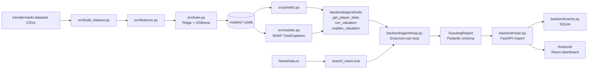

# Premier League Transfer Value Predictor — Scouting Analyst

A Premier League player-valuation model (v1) extended into an agentic
scouting analyst (v2): given a player name, the system runs a trained
XGBoost regression, explains that specific prediction with SHAP feature
attributions, searches for recent real-world context (form, injuries,
contract situation), and has a hand-rolled tool-using LLM agent
synthesize all of it into a structured, cited scouting report - grounded
in the actual model output, not invented.

Data: [transfermarkt-datasets](https://github.com/dcaribou/transfermarkt-datasets)
(CC0). Scope: Premier League only (`competition_id == "GB1"`), last 10
completed seasons (a full decade: 2016-17 through 2025-26).

## What changed from v1 to v2, and why

v1 was a pure offline ML exercise: fetch data, engineer features, fit
Ridge/LinearRegression/RandomForest, evaluate on a held-out season, done.
v2 keeps every line of that pipeline (`config.py`, `src/*.py`) unchanged
and builds a serving + reasoning layer on top of it:

- **XGBoost** added as a fourth model, evaluated side by side with Ridge
  (see Results below) - a modest but real accuracy win, not large enough
  alone to replace Ridge's interpretable coefficients.
- **SHAP** (`src/explain.py`) explains one specific XGBoost prediction at
  a time - which stats pushed this player's valuation up or down, and by
  how much (log-scale, additive) - rather than only reporting global
  feature importance.
- **Four agent tools** (`backend/agent/tools/`) wrap the existing
  pipeline (`get_player_stats`, `run_valuation`, `explain_valuation`) plus
  one genuinely new integration (`search_news`, via NewsData.io's free
  tier) as small, independently-testable, LLM-callable functions.
- **A hand-rolled agent loop** (`backend/agent/loop.py`) against Groq's
  free API - a plain loop over an OpenAI-compatible chat-completions call,
  not a framework (no LangGraph/CrewAI): four tools and one fixed
  synthesis step never justified that complexity. The LLM is never
  trusted to invent the report's actual numbers - predicted value comes
  straight from the model, and every SHAP factor or news citation in the
  final report must match something a tool call actually returned, or it
  is silently dropped (see `_assemble_report` in `loop.py`).
- **FastAPI backend** (`backend/`) exposing one `POST /report` endpoint,
  with a SQLite cache and a deterministic stub fallback when no Groq key
  is configured, so the API is never unusable without external
  credentials.
- **React/Vite/TS/Tailwind dashboard** (`frontend/`) - search a player,
  see the number, a SHAP bar chart, the cited report, and an export
  button.
- **`EVAL.md`** - the pipeline run for real against 12 known transfers,
  honest about what could and couldn't be verified without live API keys.

## Architecture



## How to run locally

**Backend + ML pipeline:**

```bash
pip install -r requirements.txt -r backend/requirements.txt

python -m src.fetch            # download + cache raw CSVs into data/raw/
python -m src.build_dataset    # -> data/processed/player_seasons.csv
python -m src.train            # trains all 4 models, writes reports/metrics.json
python -m src.visualize        # writes 4 PNG charts to reports/

python -m src.predict "Bukayo Saka" --season 2024
python -m src.explain "Bukayo Saka" --season 2024   # SHAP breakdown (xgboost only)

cp .env.example .env           # add GROQ_API_KEY / NEWSDATA_API_KEY (see below) - optional
uvicorn backend.main:app --reload --port 8000

pytest -q                      # full suite: src/, backend/agent/tools, agent loop, cache, API
```

Without a `.env`, `POST /report` still works - it falls back to a
deterministic stub (real model + real SHAP, honest placeholder text
instead of LLM synthesis). Re-running `fetch`/`build_dataset`/`train` is
safe and idempotent - raw CSVs are cached on disk and only re-downloaded
with `force=True`.

**Frontend:**

```bash
cd frontend
npm install
cp .env.example .env.local     # VITE_API_BASE_URL, defaults to localhost:8000
npm run dev
```

**Evaluation harness:**

```bash
python -m scripts.run_eval      # writes EVAL.md against 12 real players
```

### Free-tier accounts needed (all genuinely free, no trial credits)

| Service | Used for | Free tier |
|---|---|---|
| [Groq](https://console.groq.com) | Agent LLM (`llama-3.3-70b-versatile`) | No cost, rate-limited |
| [NewsData.io](https://newsdata.io) | `search_news` tool | 200 credits/day, last 48h only |
| [Render](https://render.com) | Backend hosting (optional) | Free web service, spins down when idle |
| [Cloudflare Pages](https://pages.cloudflare.com) | Frontend hosting (optional) | Free static hosting |

## Deployment

- **Backend -> Render** (`render.yaml` at repo root): connect the repo as
  a Blueprint, set `GROQ_API_KEY`/`NEWSDATA_API_KEY` as secret env vars in
  Render's dashboard. Free tier spins the service down after inactivity;
  **the first request after idle can take 30-60s+** while it cold-starts
  - a normal, explainable tradeoff for a free-tier demo, not a bug to hide.
- **Frontend -> Cloudflare Pages**: connect the repo, set the project
  root to `frontend/`, build command `npm run build`, output directory
  `dist`. Set `VITE_API_BASE_URL` to the deployed Render URL as a
  Cloudflare Pages environment variable. No extra config file needed
  beyond those dashboard settings.

Deploying both requires your own free Render/Cloudflare accounts - the
config above is provided and tested locally, but actually standing up
the live services (and tightening `backend/main.py`'s CORS
`allow_origins` from `"*"` to the real Pages origin once it exists) is a
step only you can complete with your own accounts.

## Limitations

**Hallucination risk on the agent's free-text reasoning.** Mitigated,
not eliminated: the predicted value, model name, every `key_factors`
entry, and every `news_context` citation are grounded against real tool
output (`backend/agent/loop.py`'s `_assemble_report` drops anything the
LLM cites that no tool call actually returned). What is *not* grounded -
the confidence level, its stated reasoning, and the explanatory sentences
- is genuinely the LLM's own synthesis and could still be wrong or
poorly calibrated in ways this project doesn't automatically catch. See
`EVAL.md` for what this build environment could and couldn't verify
directly.

**Free-tier constraints, accepted as reasonable for a portfolio demo:**
Groq's rate limits (not cost) become the real constraint under load;
NewsData's 200 credits/day is shared across every visitor to a deployed
instance, not per-user, and is tracked with a simple daily counter
(`backend/cache.py`) that degrades to "news unavailable" rather than
crashing once spent; Render's free web service cold-starts after
inactivity; SQLite's cache (chosen over Supabase - see `backend/cache.py`'s
docstring for the tradeoff) is wiped on every Render redeploy, not
durable across them.

**No fine-tuning.** This is pure retrieval (the four tools) plus a
trained regressor (XGBoost), deliberately, for auditability: every number
in a report traces back to a specific tool call's output, which would be
much harder to guarantee from a fine-tuned model's weights.

**Data source gaps hit along the way:**
- No free, current injury-history data source was found in
  transfermarkt-datasets or elsewhere - a 5th agent tool for it was
  explicitly skipped rather than faking one from a proxy, consistent with
  this project's existing house style (see the Feature list section
  below on `games_started`).
- `find_player_row`'s plain substring name matching doesn't fold accents
  - `EVAL.md` documents a real failure this caused (`"Moises Caicedo"` /
    `"Martin Odegaard"` don't match the dataset's accented `Moisés
    Caicedo` / `Martin Ødegaard`), a genuine, fixable gap rather than a
    hypothetical one.
- `frontend/src/types/report.ts` hand-mirrors `backend/schemas.py`'s
  Pydantic models with no codegen step - a manual-sync risk if the schema
  changes without a matching frontend edit.

## Pipeline (v1, unchanged)

| Module | Responsibility |
|---|---|
| `config.py` | Every path, season, ID, and threshold - the single source of truth |
| `src/fetch.py` | Download + cache the 5 raw CSVs |
| `src/build_dataset.py` | Aggregate appearances to one row per player per season, join player attributes and the market value *current at that season's end* |
| `src/features.py` | Filter low-minute rows, engineer `*_per_90`, `age_squared`, log1p the target, plus the shared `find_player_row` lookup |
| `src/train.py` | Fit LinearRegression / RidgeCV / RandomForest / XGBoost inside a shared `Pipeline`, evaluate on the held-out season, persist models |
| `src/predict.py` | CLI: look up one player-season's predicted vs actual value |
| `src/explain.py` | CLI + library: SHAP breakdown of one XGBoost prediction |
| `src/visualize.py` | The 4 required matplotlib charts |

## Results (test season: 2025, trained on 2016-2024)

| Model | MAE (EUR) | RMSE (EUR) | R² (log-value scale) |
|---|---:|---:|---:|
| Position-median baseline | 17,097,890 | 26,274,706 | -0.038 |
| Linear Regression | 12,820,811 | 19,543,224 | 0.482 |
| **Ridge** (α≈0.032, 5-fold CV) | **12,820,757** | **19,543,142** | **0.482** |
| Random Forest | 12,922,338 | 20,070,577 | 0.443 |
| XGBoost | 12,550,113 | 19,708,223 | 0.497 |

XGBoost was added as a fourth model - unlike Ridge's coefficients, its
predictions aren't directly interpretable from the model itself, which is
exactly why SHAP-based explanations exist; see the comparison paragraph
below for whether the accuracy gain is actually worth that tradeoff.

R² is reported on the log1p scale because that's the scale the models were
actually fit on and optimized for; an R² computed on raw euros would be
dominated by the handful of 100M+ outliers and would mostly just measure
"did you get Haaland roughly right," not overall fit quality.

**The stats-only model clears the naive baseline by a wide margin** (R² 0.48
vs -0.04 - the baseline is now *worse than predicting the training mean*)
- so season performance genuinely carries signal about market value, not
just "attackers are worth more than defenders." Ridge and plain
LinearRegression land at essentially identical accuracy (the selected
α≈0.032 is small, meaning little regularization was actually needed to
generalize to the 2025 season) - but their *coefficients* are not equally
trustworthy; see the collinearity section below for why we read Ridge's.

**Random Forest did not beat the linear models here**, which surprised me
going in - trees are usually assumed to beat linear models "for free" by
capturing non-linearities. Two likely reasons: (1) with `age_squared`
already added, the main non-linear relationship in this data is handled
explicitly, closing most of the gap a tree would otherwise win back, and
(2) even with 4,258 training rows and default hyperparameters, the forest
has no tuning to avoid overfitting to idiosyncratic training-season
players. This is a real, checkable result, not a hand-wave - see
`reports/metrics.json`.

**XGBoost vs Ridge: a real but modest win, and not a clean sweep.** XGBoost
edges out Ridge on MAE (EUR 12.55M vs EUR 12.82M, ~2.1% lower) and on R²
(0.497 vs 0.482, log scale), but it is actually *worse* than Ridge on RMSE
(EUR 19.71M vs EUR 19.54M, ~0.8% higher). Since RMSE squares errors before
averaging, it weights the largest mistakes far more heavily than MAE does
- so this split means XGBoost is a bit more accurate on the *typical*
player but slightly less reliable on the handful of largest misses (the
same stars - Haaland, Saliba, Rice - that already dominate every model's
worst errors). Put together, XGBoost is a small, genuine improvement, not
a dominant one: on this dataset it does not clearly justify giving up
Ridge's directly-readable coefficients for a black-box model, which is
exactly the gap SHAP is meant to close. That is why XGBoost is kept
alongside Ridge rather than replacing it - `SCOUTING_MODEL` in
`config.py` marks XGBoost as the model the SHAP-explainability and agent
pipeline explains (SHAP's fast `TreeExplainer` needs a tree-based model
to work), while `DEFAULT_MODEL` stays Ridge, whose own coefficients are
already its explanation and remain what `predict.py`'s CLI uses by
default.

**Widening the window from 4 seasons to 10 seasons actually lowered R²**
(0.62 -> 0.48) rather than raising it, which is the single most important
result of extending the scope and is worth understanding rather than
glossing over. More training rows should help a model generalize - and
it would, if the relationship between stats and value were stable over
time. It isn't: Premier League transfer valuations have grown
substantially since 2016-17 (broadcast deal growth, inflation, wealthier
ownership groups), and **no feature in this project encodes which year a
row is from**. A below-average 2025 midfielder and an above-average 2017
midfielder with matching stats get an identical prediction, even though
the real market would price them very differently. Over a short 4-season
window that effect is small enough to ignore; over a full decade it
becomes the dominant source of error, which is exactly why the naive
position-median baseline (blending medians across 10 seasons of a rising
market) got so much worse that it went negative. The honest fix would be
an explicit season/year feature or a year-indexed inflation adjustment on
the target - deliberately left out here so this result stays visible
rather than quietly regressed away.

## Charts (`reports/`)

- `predicted_vs_actual.png` - tight along y=x under ~EUR30M, but the model
  systematically **under-predicts** the handful of highest-value stars
  (e.g. Erling Haaland's actual EUR200M is predicted at ~EUR150M). This is
  the single clearest visual evidence of the model's biggest weakness - see
  below.
- `residuals_vs_predicted.png` - residual spread visibly widens as
  predicted value increases (heteroscedasticity): the model is precise for
  squad players, much less precise for stars.
- `ridge_coefficients.png` - `age_at_season_end` (+2.7) and `age_squared`
  (-3.2) are the two largest-magnitude coefficients, and their opposite
  signs are exactly the point: value rises with age then falls, a
  parabola no single linear age term could represent. `minutes_played` is
  the next strongest positive driver.
- `over_under_valued.png` - the 15 players the market pays most *above*
  what their raw stats predict (William Saliba, Declan Rice, Moises
  Caicedo, Bukayo Saka, Alexander Isak...) and the 15 it pays *below*
  (mostly squad/rotation players at mid-table clubs). This list is itself
  evidence for the limitations section: nearly every "overvalued" name is
  an elite, high-reputation, high-marketability player - exactly the
  intangibles a stats-only model cannot see.

## Honest limitations (of the model itself)

**Where a linear model is the wrong tool.** Player value is not a smooth,
additive function of stats - it has thresholds and interactions a linear
model can't represent: a single wonder-goal against a rival can move a
player's valuation more than a season of solid-but-unspectacular numbers;
a young player's stats matter far more than an aging player's identical
stats because of resale/potential value; and a defensive midfielder's
value depends on stats we don't have (progressive passes, tackles won) far
more than goals/assists. A linear model also can't cap or floor a
prediction - it will happily extrapolate a nonsensical value for a stat
combination outside the training range. The RandomForest exists in this
project specifically to measure that cost, and here the cost turned out to
be small (R² 0.44 vs 0.48) - evidence the *available* features are mostly
linear-ish once age is fixed, not evidence that value itself is linear.

**Which features are collinear** (correlation matrix computed on the
actual feature set):
- `appearances` and `minutes_played`: r = 0.91 - nearly redundant; both
  measure "how much did this player play."
- `goals` and `goals_per_90`: r = 0.77; `assists` and `assists_per_90`:
  r = 0.70 - the per-90 rate is derived from the raw count and shares its
  numerator, so of course they move together.
- `age_at_season_end` and `age_squared`: r = 1.00 by construction - this
  one is *intentional* collinearity (a polynomial term), not accidental,
  and is exactly why Ridge's coefficients are the trustworthy ones (see
  below), not plain OLS's.
- `appearances`/`minutes_played` and `yellow_cards`: r ~0.54-0.57 - more
  minutes simply means more opportunities to be booked, not that playing
  time causes cards.

Under this much collinearity, plain `LinearRegression`'s individual
coefficients can be unstable (small data changes can swing or even flip
them) even though its *predictions* are fine - which is why
`ridge_coefficients.png` reads Ridge's shrunk coefficients rather than
OLS's for the "what drives value" chart.

**Why age is not linear, and the fix used.** Value rises through a
player's early-to-mid 20s, peaks, then declines - a parabola, not a slope.
A single linear `age` term forces one constant slope across a 17-year-old
prospect and a 34-year-old veteran, which can't represent a peak at all.
The fix used here is the standard one for representing non-monotonic
effects while staying inside a linear model: add `age_at_season_end ** 2`
as a second feature, so the model fits `b1*age + b2*age^2`, a curve
instead of a line. The fitted signs (`age`: +2.7, `age_squared`: -3.2)
confirm the expected rise-then-fall shape.

**What the model fundamentally cannot know**, and roughly how much of the
error that explains: contract length/expiry, agent negotiating power,
club wealth and wage structure, transfer hype/media narrative, injury
history, international reputation, and resale/potential value for young
players. The evidence for how much this matters is in the charts: for the
bulk of the test season (~EUR 30M and under) predictions track the y=x
line closely, meaning stats alone explain most of the variance for
ordinary squad players. Nearly all of the model's largest errors - Saliba,
Rice, Caicedo, Saka, Isak - are elite players whose value is driven by
reputation and marketability on top of, not instead of, good stats; the
model captures the "good stats" part but has no feature for the premium
the market adds on top. Given the overall MAE is ~EUR 12.8M but the worst
individual errors reach ~EUR 81M concentrated in a small number of star
players, it's fair to say intangibles this model can't see account for a
small fraction of *total* prediction count that's wrong but a large
fraction of the *largest* errors by euro amount - the model is good at
pricing depth players and bad at pricing stars, which is the opposite of
what a scout would find most useful. `EVAL.md` reconfirms this on an
independent 12-player sample skewed toward stars (MAE EUR 55.3M there,
vs EUR 12.55M for the full test season).

**A decade also introduces a problem 4 seasons mostly hid: non-stationary
prices.** See the "widening the window" note above - none of these models
know what year a row is from, so a decade of transfer-market inflation
gets absorbed into the error term instead of being explained. This is
very likely the single largest driver of the R² drop from 0.62 (4 seasons)
to 0.48 (10 seasons), and it's a more fundamental limitation than any of
the feature-level issues above: it's not a missing feature so much as a
violated assumption (that the stats-to-value relationship is constant
over the training window), and it would keep getting worse the further
back the window is extended.

## Feature list

Counting stats (summed per player per season, Premier League matches
only): `appearances`, `minutes_played`, `goals`, `assists`,
`yellow_cards`, `red_cards`.

Engineered: `goals_per_90`, `assists_per_90` (control for playing time -
two players with 5 goals aren't equally productive if one played 900
minutes and the other 3,000), `age_at_season_end` (fractional years, not
integer - two players both "27" by whole-year age can be nearly a year
apart), `age_squared` (see above), `height_in_cm` (weak positional proxy;
kept as it's directly available and free), `position` (one-hot,
`drop="first"` to avoid the dummy-variable trap with the intercept).

Dropped from the original ask: **`games_started`** - `appearances.csv`
has no starting-lineup flag, only `minutes_played`. Faking a threshold
(e.g. "60+ minutes = start") would produce a feature that looks precise
but isn't; `minutes_played` and the per-90 rates already capture
playing-time signal without a fabricated proxy. Also dropped: a per-season
**club** feature - `players.csv` only records each player's *current*
club, not their club during a historical season, so using it would
silently mislabel past seasons.

## Project layout

```
config.py                  paths, seasons, thresholds, model + SHAP + agent constants
src/
  fetch.py                 download + cache raw CSVs
  build_dataset.py         season aggregation + leak-safe valuation join
  features.py              feature engineering, log1p target, shared find_player_row
  train.py                 4 models in sklearn Pipelines, evaluation
  predict.py               CLI lookup
  explain.py               SHAP per-prediction breakdown (xgboost only)
  visualize.py             the 4 matplotlib charts
backend/
  main.py                  FastAPI app: GET /health, POST /report
  schemas.py                Pydantic ScoutingReport/KeyFactor/NewsCitation
  cache.py                  SQLite cache: report runs, news-by-week, daily credit counter
  agent/
    client.py                Groq client + model constants
    prompts.py                system + synthesis prompt templates
    loop.py                   the hand-rolled tool-use loop
    tools/                     get_player_stats, run_valuation, explain_valuation, search_news
  tests/                     tool tests, cache tests, mocked-LLM integration test, API tests
frontend/
  src/api/client.ts          typed fetch wrapper
  src/types/report.ts         hand-kept-in-sync TS mirror of backend/schemas.py
  src/components/             PlayerSearch, ShapChart, ScoutingReportView, ConfidenceBadge, ExportButton
  src/hooks/useReport.ts       fetch/loading/error state
scripts/
  run_eval.py                writes EVAL.md against real transfers
tests/
  test_build_dataset.py    season-end date + fractional age
  test_features.py         per-90 rates, age_squared, minute filtering, log target
  test_explain.py           SHAP feature-name remapping + end-to-end
data/raw/                  cached CSVs (gitignored)
data/processed/            player_seasons.csv
models/                    joblib-persisted pipelines (gitignored)
reports/                   metrics.json, test_predictions.csv, PNG charts
EVAL.md                    12-player evaluation writeup
render.yaml                 Render free-tier backend deploy config
```
